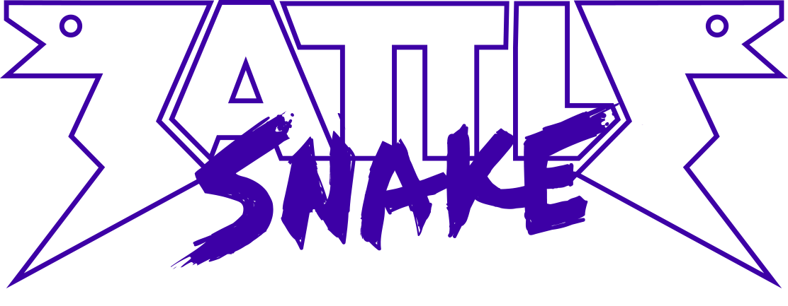

# Battlesnake 2019 AI


This is my entry for [Battlesnake](https://www.battlesnake.io) 2019 programming competition in Victoria BC being held on March 2, 2019.

Forked from the [NodeJS starter snake](https://github.com/battlesnakeio/starter-snake-node) provided by the [Battlesnake community](https://github.com/battlesnakeio/community).

## Things to work on for next year
* Multi-a* search to target. Do a* starting from each valid move and apply the success score to all the moves that have the shortest a* distance.
  * Apply a fractional score to moves with longer distance? (moves that still have valid path but not best move, maybe 1/4?)
* Mark a* target as SPACE/WARNING and search again for next best target. Maybe value those searches same as above but at 1/8 score?
* Check for possible kill/block opportunities like you are for snakes against the edge of the board but for anywhere on the board.
* Built logic so that once you hit an _ideal size_ it will switch to an alternate aggressive strategy that will target larger snakes future_2 moves rather than kill_zone. WIP.
* If move will be limited next turn given a move (ie. you move into a v tight space, but not dead end), devalue that move.

## Takeaways from Battlesnake 2019
* All food bounty game killed me.
* If an enemy snake has the same name as you, dont kill it! Its you! There may be 2 or more of your snakes on the board at the same time for the bounty snake games. Still did alright but would be nice to be knowlegable of that.

## Running the snake locally
Follow the directions given on the [Battlesnake Docs](http://docs.battlesnake.io/zero-to-snake-linux.html) in the Zero to Snake section for your operating system. When you get to the point where it tells you to clone the starter snake, you can clone this snake instead if you wish.
```shell
git clone git://github.com/tyrelh/battlesnake2019.git
```
You can also deploy this repo directly to Heroku by clicking this link. You will need a Heroku account to do this.

[](https://heroku.com/deploy)

## Resources
* [Battlesnake Homepage](https://www.battlesnake.io/)
* [Battlesnake 2019 API](http://docs.battlesnake.io/snake-api.html)
* [Battlesnake Docs](http://docs.battlesnake.io)
* [Battlesnake NodeJS Starter Snake](https://github.com/battlesnakeio/starter-snake-node)
* [My 2018 Python Entry](https://github.com/tyrelh/battlesnake2018)

## Changelog
* **v2.5:**
  * Upgraded snake from Heroku to AWS ElasticBeanstalk.
  * If all moves are DANGER (possiblity of death by head on collision), favor move that is from a snake of equal length.
* **v2.4.2:**
  * Will treat same size snakes different than larger snakes. If all 3 available moves are in the path of dangerous snakes, will favor move protected by snake of same length if exists.
  * Minimum survival health will scale down slightly as match goes on to decrease how long it gets in the late game.
* **v2.4.1:**
  * Snake will now try to coil tighter to save space when trapped an space smaller than its body and no tails are present.
  * Scale fill score down when area less than body length and no tails are present.
  * When doing first and second future fill search, move all snakes tails in 1 and 2 respectively.
* **v2.4:**
  * When enemy against wall, search for new possible kill opportunities.
* **v2.3.5:**
  * Add score bias for move bringing you closer to center of game.
* **v2.3.4:**
  * Rework hunting algorithm to favor side of smaller snake farther from the wall.
  * Some refactoring to DRY code
* **v2.3.3:**
  * Grid copy functionality to fix bug in secondary target searches.
  * Add target search redundancy to killTime for when tail is inaccessable.
* **v2.3.2:**
  * Add behaviour to kill time in the early game.
  * Add search score scaling to eating logic based on health level.
  * Mark self different than other snakes. Mostly for debugging.
  * Mark spaces near wall uniquely with their own score bais.
* **v2.3.1:**
  * Fix bug with marking own tail as a space when confident its ok.
  * Add small score bias to move moving me farther from closest dangerous snake head.
  * Add redundancy in astar for if destination is null
* **v2.3.0:**
  * Add second fill search to move scoring that will better count spaces based on the possible future moves of the snakes.
* **v2.2.1:**
  * Fix bug with kill zone marking, so snake can more accurately hunt prey.
  * Fix bug with tail marking so snake can more often use tail spaces as empty spaces.
* **v2.2.0:**
  * Built custom logging. Logs are accumulated throughout a game and then written to a file on /end. A directory of logs is available at the index of the server.
* **v2.1.0:**
  * Snake will now try to become the largest snake. When it is the largest, it will seek out the nearest smaller snake to try to kill them.
* **v2.0.2:**
  * Fill search working. Can now score moves based on the space available if taking each move and what is in that space (tails, enemies, foods, etc).
* **v2.0.1:**
  * Set up move scoring system so that I can rank each move based on a number of different inputs.
  * Also marked spaces near walls to try to avoid them.
* **v2.0.0:**
  * Inital port of algorithms from my [last year Python entry](https://github.com/tyrelh/battlesnake2018). Basic food finding using A* pathfinding. Is only seeking closest food rather than closest accessable food which leads to unnessesary deaths.
* v1 of this AI is my [2018 entry](https://github.com/tyrelh/battlesnake2018) written in Python.

_*The header image used in this readme is the property of [Battlesnake](https://www.battlesnake.io/)._